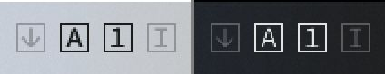

# LOKI - the Keyboard Indicator

Lightweight & Open source Keyboard Indicator for Windows 10

## Description

This app shows icons in the System tray (Taskbar notification area) indicating the states of three lock keys
(Num Lock, Caps Lock, Scroll Lock) and Insert key.

Written in C/C++ from scratch and directly calling Windows API,
LOKI runs on less memory and less dependencies (unlike .NET apps, etc...),
and thus is resource-friendly.

| Targeted System  | Windows 10 |
| :--------------- | :--------- |
| Dev. Environment | MinGW      |

## Download & Usage

You can get the zip of the app on [Release](https://github.com/inucat/LOKI_Keyboard_Indicator/releases)
page.
Download, then extract it and just double-click the `loki.exe`.
Then the icons will appear in the Task tray!

The icon color changes when the key state is toggled.

LOKI supports the Windows theme color of Dark/Light.
It dynamically adapts the icons to current theme!

On these icons:

- Left click to toggle key state.
- Right click to show menu.

## License & Disclaimer

This software is licensed under BSD 3-Clause License.
You can use, redistribute, and modify the software under the several CONDITIONS.
See [LICENSE](./LICENSE) for details.

As described in LICENSE, note that
This software is provided WITHOUT ANY WARRANTIES,
and the author SHALL NOT be liable for any damages.

## Changelog

See [Changelog](./Changelog.md) for details.

---

    (c) 2021 inucat
