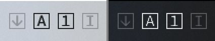

[リポジトリを見る（英語）](https://github.com/inucat/LOKI_Keyboard_Indicator)

# LOKI - キーボードインジケータ

Windows10向けの軽量・オープンソースなキーボードインジケータです。

## 説明

タスクバーの通知領域にアイコンを表示して、
ロックキー（Num Lock, Caps Lock, Scroll Lock）とInsertキーの
オン・オフ状態をお知らせします。

C/C++言語で一から書いてWindows APIを直接呼び出しているため、
省メモリで、追加のライブラリ依存の要らない
省資源アプリケーションです。

| 対象OS   | Windows 10     |
| :------- | :------------- |
| 開発環境 | MinGW & VSCode |

## ダウンロードと使い方

1. [Release](https://github.com/inucat/LOKI_Keyboard_Indicator/releases/latest)からZIPをダウンロードします。
2. ZIPを解凍してフォルダ内の `LOKI.exe` を実行します。
3. タスクバーにアイコンが表示されればOKです！

キーのロック状態に応じてアイコンの色が変わります。

LOKIはWindowsのダークテーマ・ライトテーマに対応しており、
テーマの変更にも追従します。

アイコン上では

- 左クリックすると各キーの状態を切り替えます。
- 右クリックするとメニューを表示します。

Windowsの既定では、通知アイコンはしばらくすると収納されてしまいます。
アイコンが常に表示されるように、以下の手順で変更することができます。

1. タスクバーを右クリックして「⚙タスクバーの設定」を選択。
2. 「通知領域」の「表示するアイコンを表示します」のリンクをクリック。
3. LOKIの各アイコンのスイッチ、または「常にすべてのアイコンを表示」のスイッチをオン。

## 使用許諾および免責事項

このソフトウェアは修正BSDライセンスの下で公開されています。
ソフトウェアの使用・再配布・改造は **いくつかの条件の下で** 許可されます。
詳しくは[LICENSE](./LICENSE)をご覧ください。

LICENSEに記載の通り、
「このソフトウェアはいかなる保証もなく提供され、
作者はいかなる損害について責任を負わないものとする」
ことに注意してください。

## 変更履歴

[Changelog](./Changelog.md)をご覧ください。

## バグ報告・要望など

- GitHub:   [Issue](https://github.com/inucat/LOKI_Keyboard_Indicator/issues) を作る
- Twitter:  [@inucat4](https://twitter.com/inucat4) までリプもしくはDM（利用可能な場合）

---

    (c) 2021 inucat
